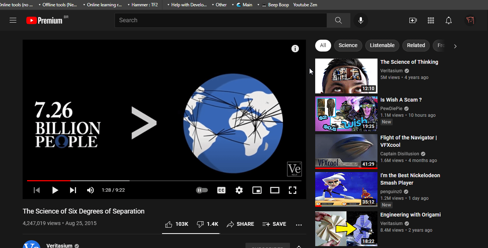
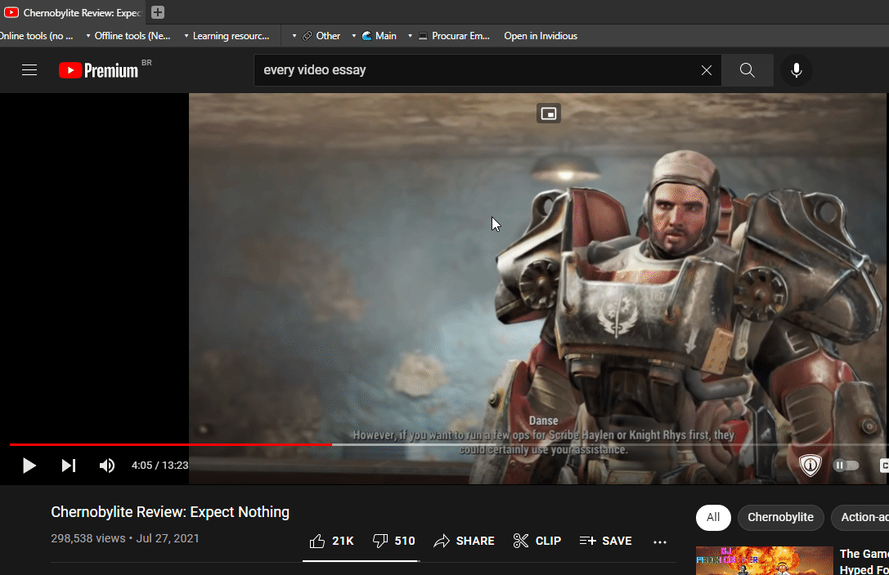

> Please make sure to [README](./README.md "README!!!") for the installation guide

## [Youtube Zen][zen_code]

Acts as a toggle; disables some features from the Youtube interface in order to focus more on watching the video (without getting sucked into the [recommendation rabbit hole](https://medium.com/swlh/understanding-the-youtube-rabbit-hole-4d98e921eabe))



```js
javascript:(()=>{let elementexists=document.getElementById("yt-thing");if(elementexists===null){console.log("Youtube is now in *Zen Mode",),document.head.insertAdjacentHTML("beforeend","<style id='yt-thing'>div#container > div#end > div#buttons > ytd-notification-topbar-button-renderer, div#primary > ytd-rich-grid-renderer > div#contents, ytd-watch-flexy a.ytp-next-button, ytd-watch-flexy a.ytp-prev-button {display: none !important} div#secondary, div#primary-inner > ytd-comments#comments, div#contentContainer ytd-guide-renderer#guide-renderer > div#sections > ytd-guide-section-renderer:nth-child(2), div#secondary-inner > div#related {display: none !important} div#primary-inner > div:not(#player) {filter:saturate(5%)}</style>");}else if(String(elementexists.innerHTML).includes("none")){console.log("Youtube is now in *Normal Mode",),elementexists.remove(),document.head.insertAdjacentHTML("beforeend","<style id='yt-thing'>div#container > div#end > div#buttons > ytd-notification-topbar-button-renderer, div#primary > ytd-rich-grid-renderer > div#contents, ytd-watch-flexy a.ytp-next-button, ytd-watch-flexy a.ytp-prev-button {display: flex !important} div#secondary, div#primary-inner > ytd-comments#comments, div#contentContainer ytd-guide-renderer#guide-renderer > div#sections > ytd-guide-section-renderer:nth-child(2), div#secondary-inner > div#related {display: block !important} div#primary-inner > div:not(#player) {filter:saturate(1)}</style>");}else{console.log("Youtube is now in *Zen Mode"),elementexists.remove(),document.head.insertAdjacentHTML("beforeend","<style id='yt-thing'>div#container > div#end > div#buttons > ytd-notification-topbar-button-renderer, div#primary > ytd-rich-grid-renderer > div#contents, ytd-watch-flexy a.ytp-next-button, ytd-watch-flexy a.ytp-prev-button {display: none !important} div#secondary, div#primary-inner > ytd-comments#comments, div#contentContainer ytd-guide-renderer#guide-renderer > div#sections > ytd-guide-section-renderer:nth-child(2), div#secondary-inner > div#related {display: none !important} div#primary-inner > div:not(#player) {filter:saturate(5%)}</style>")}}();
```

Known Bugs:

- Previous Button appears outside of playlists when out of Zen Mode
- Next/Previous Buttons appear on Fullscreen playback
- Mobile View doesn't remove the recommended in Zen Mode
- Home screen sometimes doesn't appear when going out of Zen Mode

***Usually either changing the page language, opening a new YouTube tab, or just reopening the browser should fix them.***

## [Custom Playback Speed][playback_code]

Presents a popup asking how much to change the playback speed of every video element in a page. Values can range from 0-16.


```js
javascript:(()=>{let playspeed=prompt("Enter the desired playback speed (0-16)","1");if(playspeed===null||playspeed>16||playspeed<0){playspeed=1;}
document.querySelectorAll("video").forEach((e)=>{e.playbackRate=playspeed;});console.log(`Playback Speed is: ${playspeed}`)})();
```

## [Open on Invidious][invidious_code]

Invidious is an alternative, privacy focused 'front-end' to access YouTube. The title is self explanatory. 



```js
javascript:(()=>{let url=location;let newUrl="redirect.invidious.io"+url.pathname+url.search;let isYoutube=url.origin.includes("youtube")?true:false;let isVideo=url.href.includes("watch?v")?true:false;if(!isYoutube||!isVideo){return alert(`Could not open video:${url}\n\nIn:${newUrl}`);}else{window.open("https://"+newUrl);console.log(`This is the new Url: https://${newUrl}`)}})();
```

***By default, it's set to redirect to `redirect.invidious.io` where you can choose an instance. You can change that by changing the newUrl string to your desired instance (no need to use a `/` after)***


[zen_code]: ./readable_code/youtube_zen_mode
[playback_code]: ./readable_code/custom_video_playback.js
[invidious_code]: ./readable_code/open_on_invidious.js
